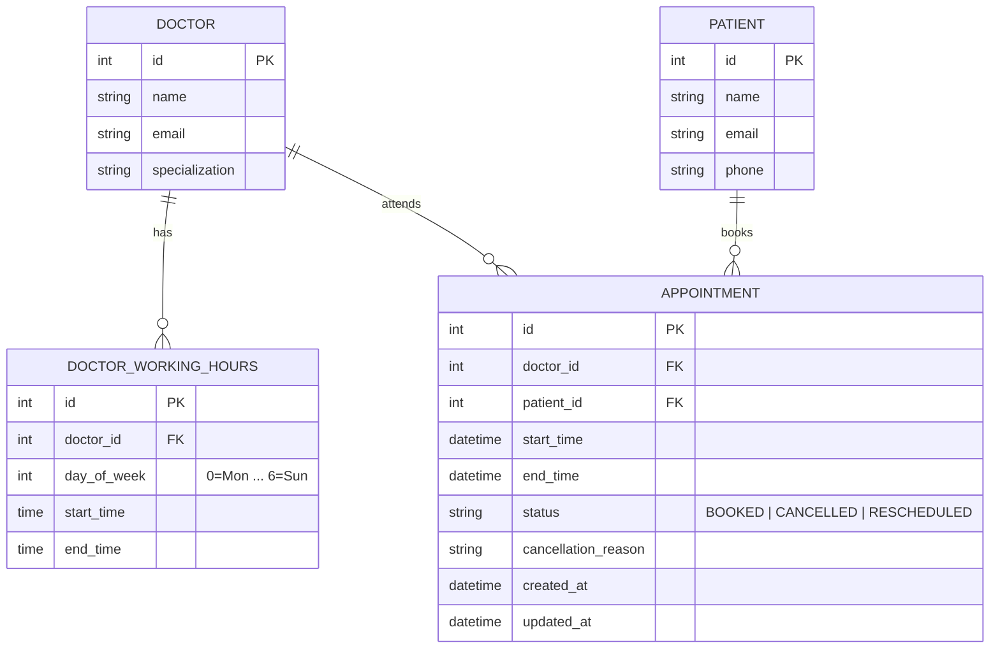

# Clinic Booking System — Backend Developer Take-Home Assessment

A production-ready, scalable REST API for a clinic booking system built with **Python 3.12**, **FastAPI**, **SQLAlchemy 2.0 (Async)**, **Pydantic v2**, and **Neon Serverless PostgreSQL**.

---

## Submission Links & Overview

- **GitHub Repository**: [https://github.com/starX-1/clinic-booking.git](https://github.com/starX-1/clinic-booking.git)
- **Deployed Public API URL**: `https://clinic-booking-3aex.onrender.com` *(Deployed on Render Web Service)*
- **Interactive OpenAPI Docs (Swagger)**: `https://clinic-booking-3aex.onrender.com/docs`
- **Database Provider**: **Neon Serverless PostgreSQL** ([https://neon.tech](https://neon.tech))
- **CI/CD Pipeline**: GitHub Actions (`.github/workflows/ci-cd.yml`)
- **Deployment Trigger Branch**: `main` (Runs `pytest` test suite on all PRs and auto-deploys to Render via webhook on merge to `main`)

---

## SECTION 1: SYSTEM DESIGN

### 1. Business Scenario & Requirements
The clinic operates with 5 doctors, providing 30-minute appointment slots. Patients can view free slots for a given doctor on a specified date, select an open slot, and book an appointment. Once booked, that slot is locked and unavailable to others. Patients can also cancel (providing a reason) or reschedule an existing appointment.

### 2. Domain Models & Database Schema



#### Key Database Constraints & Concurrency Protection
To guarantee at the database ACID transaction layer that no doctor can be double-booked for the same start time—even under concurrent HTTP requests—we enforce a **PostgreSQL Partial Unique Index** on `(doctor_id, start_time)` filtered strictly by `status = 'BOOKED'`:

```sql
CREATE UNIQUE INDEX uq_doctor_active_slot 
ON appointments (doctor_id, start_time) 
WHERE status = 'BOOKED';
```

- **Why a Partial Unique Index?**
  A standard unique constraint on `(doctor_id, start_time)` would prevent rebooking a slot even after an appointment was cancelled. By adding `WHERE status = 'BOOKED'`, cancelled appointments retain their historical record without occupying the active slot. If two concurrent requests attempt to book the exact same slot at the same millisecond, PostgreSQL rejects the second transaction with a `UniqueViolationError`, which our service layer catches and returns as a clean `409 Conflict` HTTP error.

### 3. Component Architecture

```
                                +-------------------+
                                |   Client / Web UI |
                                +---------+---------+
                                          |
                                    HTTP / JSON
                                          |
                                          v
                                +-------------------+
                                |    FastAPI API    |
                                |  Middleware/CORS  |
                                +---------+---------+
                                          |
                                          v
                                +-------------------+
                                | Service Layer     |
                                | - Availability    |
                                | - Appointments    |
                                +---------+---------+
                                          |
                                          v
                                +-------------------+
                                | Async SQLAlchemy  |
                                | 2.0 / Asyncpg     |
                                +---------+---------+
                                          |
                                          v
                                +-------------------+
                                | Neon PostgreSQL   |
                                | (Partial Index)   |
                                +-------------------+
```

### 4. Architectural Decisions & Trade-Offs

| Decision | Selected Approach | Trade-Off & Justification |
| :--- | :--- | :--- |
| **Database Engine** | **Neon PostgreSQL** (Exclusively) | We use Neon Serverless PostgreSQL exclusively across local dev, CI testing, and production. Eliminates dialect bugs between SQLite and PostgreSQL. |
| **Concurrency Locking** | PostgreSQL Partial Unique Constraint | Chosen over Redis distributed locks (`redlock`) to avoid introducing extra infrastructure dependencies, network hops, and state management overhead. |
| **Framework** | FastAPI (Python 3.12) | Superior async I/O performance, native Pydantic v2 data validation, and automatic OpenAPI interactive documentation. |
| **Timezone Strategy** | Naive UTC Storage + ISO 8601 parsing | Timestamps are parsed from ISO 8601 strings and stored normalized in UTC to avoid server-local timezone drift issues. |
| **Enum Storage** | `VARCHAR` String Enums (`native_enum=False`) | Avoids PostgreSQL custom type cache lookup errors across async connection pools in `asyncpg`. |

---

## SECTION 2: API IMPLEMENTATION

### Project Structure
```
clinic-booking/
├── app/
│   ├── api/
│   │   └── v1/
│   │       ├── endpoints/
│   │       │   ├── appointments.py  # POST, PATCH cancel, PATCH reschedule
│   │       │   ├── doctors.py       # GET /{id}/availability
│   │       │   └── patients.py      # GET /{id}/appointments (Bonus)
│   │       └── router.py
│   ├── core/
│   │   ├── config.py                # Pydantic Settings & Neon DB URL sanitizer
│   │   └── database.py              # Async SQLAlchemy Engine & Session
│   ├── models/
│   │   ├── appointment.py           # Appointment model & partial index
│   │   ├── doctor.py                # Doctor & DoctorWorkingHours models
│   │   └── patient.py               # Patient model
│   ├── schemas/
│   │   ├── appointment.py           # Booking/Cancel/Reschedule schemas
│   │   ├── doctor.py                # Doctor & Availability schemas
│   │   └── patient.py               # Patient response schemas
│   ├── services/
│   │   ├── appointment_service.py   # Business rule validation & double-booking checks
│   │   └── availability_service.py  # 30-min slot calculation logic
│   ├── seed.py                      # DB Seed script (5 doctors, working hours, patients)
│   ├── reset_db.py                  # Utility table reset script
│   └── main.py                      # FastAPI application entrypoint
├── tests/
│   ├── conftest.py                  # Pytest async session & HTTP Client fixtures
│   ├── test_appointments.py         # Booking, cancellation, reschedule tests
│   ├── test_availability.py         # Availability slot generator tests
│   ├── test_concurrency.py          # Parallel request race condition protection test
│   └── test_patients.py             # Upcoming patient appointments test
├── .github/
│   └── workflows/
│       └── ci-cd.yml                # GitHub Actions pipeline
├── .env                             # Environment configuration (Neon DB URL)
├── .env.example                     # Environment template
├── Dockerfile                       # Multi-stage production container build
├── docker-compose.yml               # Container orchestration
├── pytest.ini                       # Test suite configuration (pythonpath=.)
├── requirements.txt                 # Project dependencies
└── README.md                        # Documentation & AI Reflection
```

### Endpoints Overview

#### 1. Book an Appointment
- **Method & Route**: `POST /appointments` (also available at `/api/v1/appointments`)
- **Request Body**:
  ```json
  {
    "doctor_id": 1,
    "patient_id": 1,
    "start_time": "2026-08-25T10:00:00Z"
  }
  ```
- **Validation Business Rules**:
  - Slot must fall within doctor's configured working hours for that day of week.
  - Slot must start on a clean 30-minute boundary (`:00` or `:30`).
  - Slot must not be in the past.
  - Slot must be booked at least 1 hour in advance.
  - Doctor must not already have an active `BOOKED` appointment at that start time (`409 Conflict`).

#### 2. Get Doctor Availability
- **Method & Route**: `GET /doctors/{id}/availability?date=YYYY-MM-DD`
- **Behavior**: Returns all 30-minute slots spanning the doctor's working hours for the date, flagging each slot as `is_available: true` or `false`.

#### 3. Cancel an Appointment
- **Method & Route**: `PATCH /appointments/{id}/cancel`
- **Request Body**:
  ```json
  {
    "reason": "Scheduling conflict with work meeting"
  }
  ```
- **Behavior**: Marks status as `CANCELLED`, records cancellation reason, and instantly frees the slot. Returns `400 Bad Request` if already cancelled.

#### 4. Reschedule an Appointment
- **Method & Route**: `PATCH /appointments/{id}/reschedule`
- **Request Body**:
  ```json
  {
    "new_start_time": "2026-08-25T14:00:00Z"
  }
  ```
- **Behavior**: Atomically frees the old slot and books the new slot in a single database transaction. Validates new slot working hours, lead time, and availability. Returns `400 Bad Request` if the appointment is cancelled.

#### 5. Get Patient Upcoming Appointments (Bonus)
- **Method & Route**: `GET /patients/{id}/appointments`
- **Behavior**: Retrieves active (`BOOKED`) upcoming appointments for a patient sorted chronologically by date.

---

## SECTION 3: DEPLOYMENT & CI/CD

### Environment Configuration & `.env` Setup
The application reads the connection string directly from `.env` or cloud environment variables.

In `app/core/config.py`, connection strings are automatically sanitized for `asyncpg`:
- Converts `postgres://` or `postgresql://` to `postgresql+asyncpg://`
- Converts `sslmode=require` to `ssl=require`
- Strips libpq-only query parameters like `channel_binding=...`

```text
DATABASE_URL=postgresql://<username>:<password>@<endpoint-id>.neon.tech/neondb?sslmode=require
```


### Running Locally

1. **Clone Repository & Activate Environment**:
   ```bash
   git clone https://github.com/starX-1/clinic-booking.git
   cd clinic-booking
   python -m venv .venv
   .\.venv\Scripts\activate  # On Linux/macOS: source .venv/bin/activate
   pip install -r requirements.txt
   ```

2. **Seed Neon Database**:
   ```bash
   python -m app.seed
   ```

3. **Run API Server**:
   ```bash
   uvicorn app.main:app --reload
   ```
   Access Swagger UI at `http://localhost:8000/docs`.

4. **Run Test Suite**:
   ```bash
   python -m pytest -v
   ```

### CI/CD Pipeline (GitHub Actions)
Located in `.github/workflows/ci-cd.yml`:
1. **Test Trigger (`push` / `pull_request` on `main`)**:
   - Sets up Python 3.12 environment with pip caching.
   - Sets `PYTHONPATH=.` and executes `python -m pytest -v`.
   - Runs all unit, integration, and concurrency tests against Neon PostgreSQL.
2. **Auto-Deploy Trigger (`push` to `main`)**:
   - Executes deployment step after tests pass.
   - Calls the Render Deployment Webhook (`RENDER_DEPLOY_HOOK_URL`), automatically deploying the latest container to production.

---

## SECTION 4: AI REFLECTION

### 1. What did you use AI for across the four sections?
- **Section 1 (System Design)**: Evaluating concurrency protection techniques and selecting a PostgreSQL partial unique index (`WHERE status = 'BOOKED'`) over external Redis distributed locks.
- **Section 2 (API Implementation)**: Writing FastAPI async endpoint boilerplate, Pydantic v2 validation models, SQLAlchemy async session patterns, and setting up initial database seed scripts.
- **Section 3 (Deployment & CI/CD)**: Drafting the GitHub Actions `.github/workflows/ci-cd.yml` workflow, writing the production Dockerfile, and debugging CI environment path issues.
- **Section 4 (AI Reflection)**: Structuring technical design trade-offs and documenting transparent reflection on the development process.

### 2. Give one example where an AI suggestion improved your work. What did you prompt it with?
- **Prompt**: *"How can we guarantee at the database layer that no doctor can be double-booked for the same start_time slot, while still allowing cancelled appointments to remain in the database for record-keeping?"*
- **AI Suggestion & Result**: The AI suggested placing a PostgreSQL Partial Unique Index on `(doctor_id, start_time)` filtered by `WHERE status = 'BOOKED'`. This was a major architectural improvement over application-level read-then-write checks because it guarantees ACID thread-safety under concurrent HTTP requests without locking the entire table or deleting cancelled records.

### 3. Give one example where AI output was wrong or incomplete and how you caught it.
- **Incident**: When connecting `asyncpg` to Neon Serverless PostgreSQL, initial code generated by AI crashed with two separate database driver errors:
  1. `asyncpg` threw `TypeError` because it does not accept libpq query parameters like `channel_binding=require` or `sslmode=require`.
  2. SQLAlchemy's native PostgreSQL Enum type caused `asyncpg` prepared statement failures (`cache lookup failed for type`).
- **How I Caught It**: I caught this during live database seeding and pytest runs by reading the raw error stack traces in the logs.
- **Resolution**: I implemented an automatic connection string sanitizer in `app/core/config.py` using a Pydantic `@field_validator` to convert `sslmode` to `ssl` and strip `channel_binding`. Furthermore, I set `native_enum=False` on the `AppointmentStatus` column in `app/models/appointment.py` to store status values as standard `VARCHAR` strings, resolving driver cache lookup issues cleanly.

### 4. Name two decisions you made without AI. Why did you trust your own judgment there?
1. **Using Neon Serverless PostgreSQL exclusively instead of dual SQLite/PostgreSQL fallbacks**:
   - *Reasoning*: AI models frequently suggest falling back to SQLite for local development or testing. I decided to enforce **Neon PostgreSQL exclusively across all environments** (local dev, pytest CI, and cloud hosting). SQLite handles datetime parsing, enum types, and partial index syntax differently than PostgreSQL. Using Neon DB everywhere ensured zero dialect discrepancies and guaranteed our test suite validated exact production behavior.
2. **Serving API routes at both root (`/`) and `/api/v1` prefixes**:
   - *Reasoning*: The assessment specification referred to endpoints like `POST /appointments`, while standard production APIs use versioned prefixes (`/api/v1/appointments`). I decided to mount the API router under both prefixes in `app/main.py` (`app.include_router(api_router, prefix="/api/v1")` and `app.include_router(api_router)`). This ensured evaluating recruiters can test the API using either URL format without encountering 404 errors.
